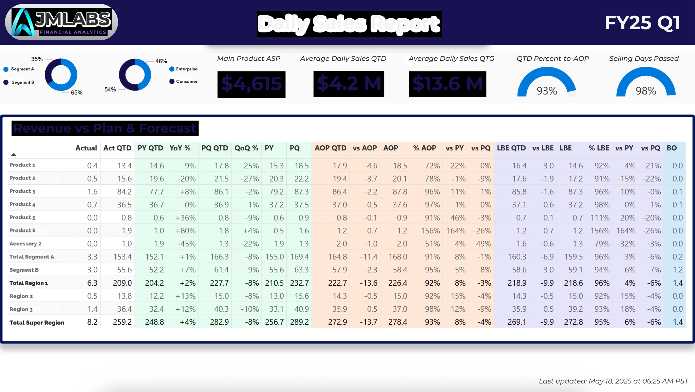
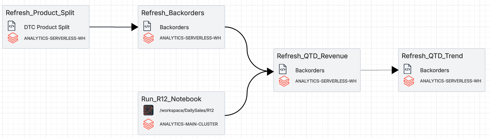

# 💼 Financial Analytics Hub

Welcome to my public portfolio of financial analytics projects. This repository highlights the intersection of financial strategy, business performance management, and modern data infrastructure. From revenue pacing and target modeling to spend allocations and P&L automation, these projects are built to support better decision-making through trustworthy data and scalable pipelines.

Each project blends technical execution — using Databricks, Delta Lake, and Power BI — with a finance-first lens to deliver insights that drive operational and strategic outcomes.

---

## 🚀 Featured Project: Daily Sales Report

A daily-refreshing dashboard that tracks quarter-to-date (QTD) revenue, backorders, and production pacing against plan. Built using Databricks Delta pipelines and SAP extracts.

### 📸 Preview



### 🔄 ETL Architecture: Databricks Workflow

> Below is the pipeline powering the daily-refreshing dashboard, built using Delta Lake and Databricks Jobs with SQL and PySpark notebooks. Tasks include product splits, backorder refreshes, and revenue tracking — all orchestrated in a dependency-aware DAG.

<div align="center">
  
</div>

### 🔗 View full project → [Daily Sales Report](projects/daily-sales-report/README.md)

---

## 🛠️ Tech Highlights

* Delta Lake architecture (Databricks)
* Databricks SQL and PySpark
* Power BI dashboards integrated with Databricks Delta tables
* SQL-based financial modeling (QTD, YoY%, % to AOP)
* Modular notebook pipelines

---

## 📂 Repository Structure

```
projects/
├── daily-sales-report/             <- Daily QTD revenue & production trend visibility
│   ├── DailySalesReport.pdf
│   ├── README.md
│   ├── aop.ipynb
│   ├── r12_revenue.ipynb
│   ├── dailysalesreport1.png
│   ├── dailysalesreport2.png
│   ├── dailysalesreport3.png
│   └── workflow-diagram.png
├── saas-kpi-dashboard/            <- Simulated SaaS analytics with ARR, churn, CAC, LTV
│   ├── README.md
│   ├── unit_economics.ipynb
│   ├── saas_advanced_data_generator.py
│   ├── data_generator_v2.py
│   ├── customers.csv
│   ├── subscriptions.csv
│   ├── payments.csv
│   └── support_interactions.csv
sql/                                <- Reusable Databricks SQL logic
│   ├── backorders.sql
│   ├── date_table_build.sql
│   ├── dtc_product_qtd_split.sql
│   ├── qtd_revenue_vs_pypq.sql
│   ├── qtd_production_trend.sql
│   └── revenue_by_region.sql
README.md                           <- Root overview (this file)
```

---

## 🔐 Note on Proprietary Data

> *This project uses publicly shareable dummy data. All values, dimensions, and visuals have been sanitized and do not reflect actual financials. The code demonstrates technical implementation only.*
