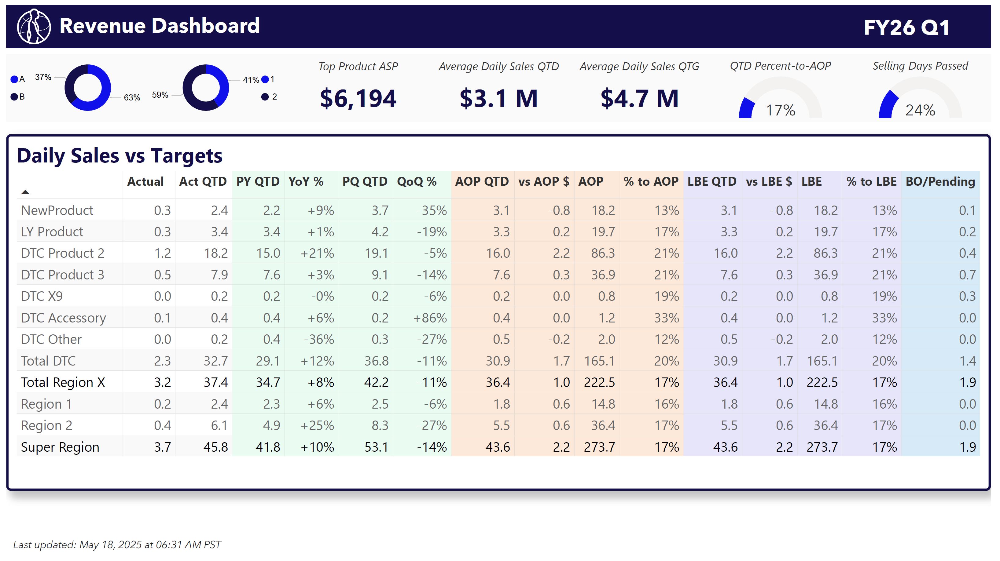
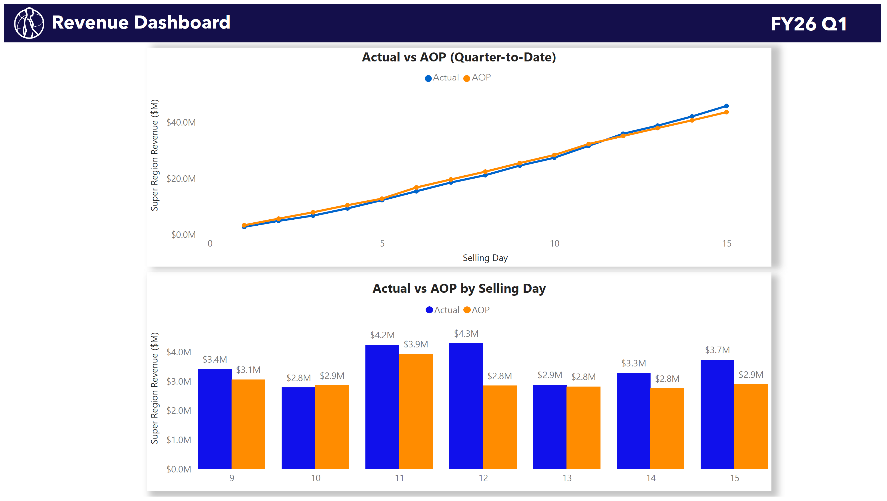
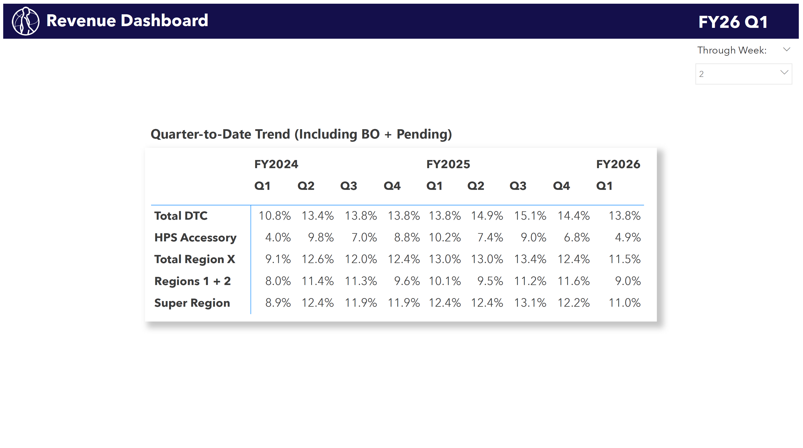
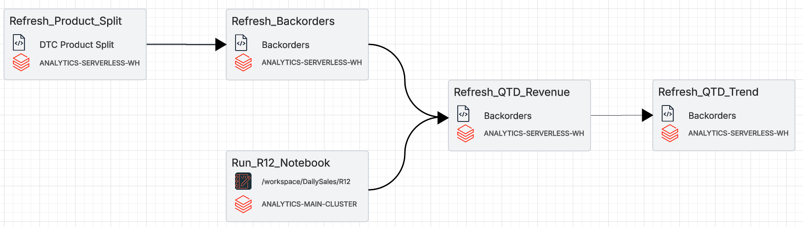

# Revenue Dashboard

This Power BI dashboard provides a daily revenue snapshot across a global healthcare business. It integrates SAP transactional level data, AOP targets, and production logic across product lines, channels, and regions using Databricks pipelines and Delta Lake architecture.

---

## 📊 Dashboard Overview

The report contains two main pages:

**Page 1 – Daily Output Table**

* Quarter-to-date (QTD) Revenue by Product and Region
* YoY% and QoQ% performance
* % to AOP (Annual Plan) and % to LBE (Rolling Forecast)
* Backorder/Pending sales

**Page 2 – Time Series View**

* Cumulative Actual vs AOP by Selling Day
* Daily variance visualized across the quarter

**Page 3 – Historical Trends**

* Prior Year and Prior Quarter comparisons
* Daily pace indicators across multiple timeframes

<details>
  <summary>📷 Preview (click to expand)</summary>







</details>

---

## ⚙️ Pipeline Architecture

This dashboard is powered by a set of Delta Live Table pipelines and scheduled notebooks:

**ETL Flow Summary:**

* `Product_Split` and `Backorders` Delta tables refresh first
* `QTD_Revenue` are calculated using latest SAP loads
* `R12_Revenue' (Region 1 & Region 2) is refreshed via a Python notebook
* Final `QTD_Trend` table aggregates actuals vs targets weekly pacing



---

## 📂 Project Structure

```
daily-sales-report/
├── DailySalesReport.pdf            <- Full report w/ daily scheduled refresh & email delivery
├── README.md                       <- This file
├── aop.ipynb                       <- AOP Delta pipeline
├── r12_revenue.ipynb               <- Regional QTD refresh job
├── dailysalesreport1.png           <- Screenshot of main dashboard
├── dailysalesreport2.png           <- Screenshot of current trend & variance charts
├── dailysalesreport3.png           <- Screenshot of historical trends
└── workflowdiagram.png             <- Pipeline architecture
```

---

## 🔐 Note on Proprietary Data

> *This project uses publicly shareable dummy data. All values, dimensions, and visuals have been sanitized and do not reflect actual financials. The code demonstrates technical implementation only.*
